# User Guide: Community Referral Application #

**Team Name:** Devs on FHIR
**Mentors:** Arunkumar Srinivasan (external), Jon Bidwell (TA)
**Team Members:** Dhruv Saksena, Elizabeth Coviello, Venu Shankar, Xia Lee
**Project Name:** [Leverage Population Health Data To Improve Patient Adherence In Community Referral](http://cs6440.gatech.edu/wp-content/uploads/sites/634/2017/09/10.-CatalogPageCDCSrinivasan-Loonsk.pdf)

#### GitHub Repository
* https://github.com/CDCgov/GaTech-Fall2017-Srinivasan-ImproveAdherence-DEVSonFHIR

#### Description

This is a proof-of-concept application demonstrating the usage of population health data to improve the lifestyle change program referral process. It provides a way for healthcare providers to engage and encourage patients in participating in lifestyle change programs by providing relevant information for each patient. Rather than presenting the same general information for all patients, this application uses the patient's information (marital status, race, gender and age) to filter the outcome for the group of patients that are the most demographically similar to the selected patient. The group's aggregate information for each referral program is clearly presented in a set of interactive charts to better communicate the expected results for the patient. From this information, the healthcare provider can determine which program may be best suited for the patient, and start the referral process.

As this not a production application, the data used is sample/mocked data. This version of the application supports referrals for two conditions: high blood pressure and diabetes.

#### Application Components and Docker Configured Ports

*The docker-compose.yml file in the “Final Delivery” directory includes the configuration, which can be modified as needed.*

* **FHIR server:** Configured to run on port 8100 by default.
FHIR server with sample patient data
* **CDS Hooks server:** Configured to run on port 8080 by default.
CDS Hooks Sandbox server that acts as a sample EHR server for the project
* **Referral (CDS Hooks) service:** Configured to run on port 8200 by default.
CDS Hooks service to determine if a patient qualifies for a program referral
* **Referral Application server:** Configured to run on port 5000 by default.
Application server to host the Flask application with sample population health data and referral program information.

#### Installation

All components listed above can be set up by a single docker-compose command after setting a *BASE_URL* value to indicate where the application will run. Installation and verification instructions can be found in *Special Instructions*.

#### Using Community Referral Application

1. In a web browser, navigate to BASE_URL:8080, which is the sample EHR system with CDS Hooks.  If you are using a proxy, please navigate to the CDS Hooks server URL as configured by your proxy setup.  When viewing a patient's medical record, the EHR will display a card if a referral can be made. In the example below, we can see that patient "Peggy Howe" meets the criteria for high blood pressure referral.  This check is done by the Referral (CDS Hooks) service.
  
  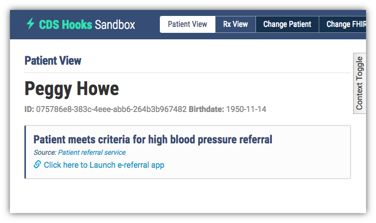

2. A different patient can be selected by clicking on "Change Patient" on the top menu >> click on the desired new patient (e.g. Kenneth Wilderman) >> click on "Save". If the list of names doesn't appear, you can still select a patient after clicking "Change Patient" by directly entering their ID into the "Enter Patient ID" text box and clicking "Save". For the purposes of the project demonstration, the patients that can be tested are:

Patient ID | Patient Name | Conditions
------------ | ------------- | -------------
099e7de7-c952-40e2-9b4e-0face78c9d80 | Buena Abbot | No qualifying conditions
075786e8-383c-4eee-abb6-264b3b967482 | Peggy Howe | High blood pressure
5ac20912-c054-4f26-8138-c4ce8d0b4b66 | Joel Johnson | No qualifying conditions
b52d3d2a-c7de-462a-96bc-19996c1919b5 | Max Little | No qualifying conditions
9128b189-f7c4-4f45-b5a8-718f5f3c6ed7 | Dwight Upton | Diabetes
8c6ece7b-4edb-423b-9dd6-3f677e6f878a | Kenneth Wilderman | Diabetes & High blood pressure
 
  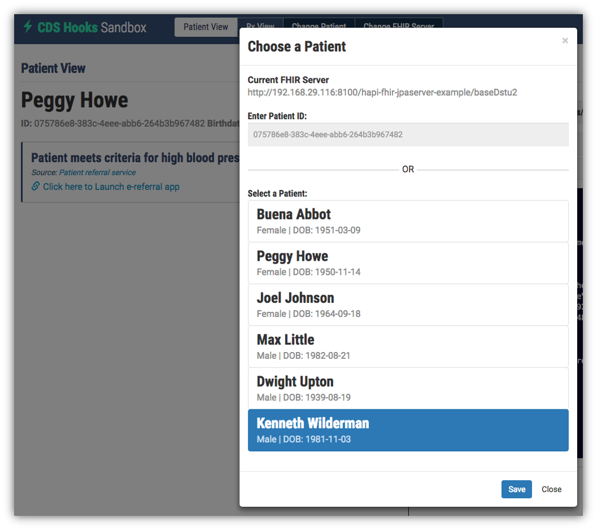

3. In the example below, we can see that patient "Kenneth Wilderman" meets the criteria for both high blood pressure and diabetes referrals. Click on "Click here to Launch e-referral app" in one of the cards to make a referral for a specific condition.

  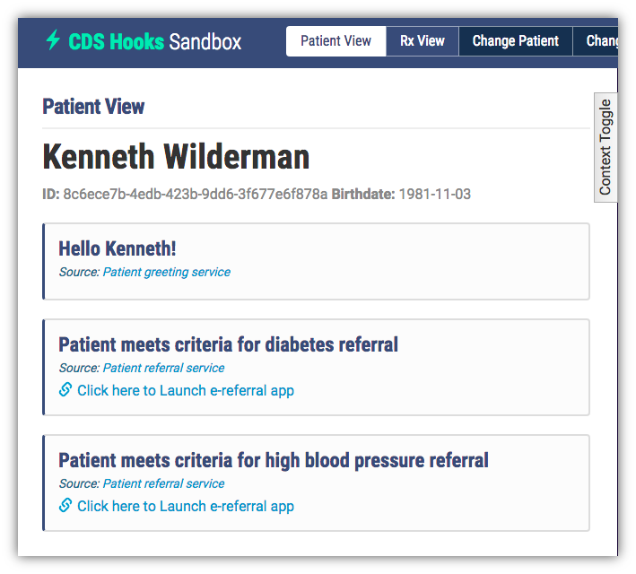

4.  This link will lead to the referral application 
	```
	$BASE_URL:5000/patient?user_id=*uid*&conditions=*diagnosis*
	```
 where *uid* is the selected ID of the patient and *diagnosis* is high_blood_pressure or diabetes. The referral application will use the user ID to fetch the relevant information about the patient and display on the top of the page. The example below includes the two diagnoses for Kenneth Wilderman, his demographic information (gender, age, race and marital status), and the latest medical test results (A1C, blood pressure and BMI) from his patient record.
 The *Referral History* section is in place to demonstrate the helpful information that can assist the communication between the physician and the patients - it is currently static for all patients.
	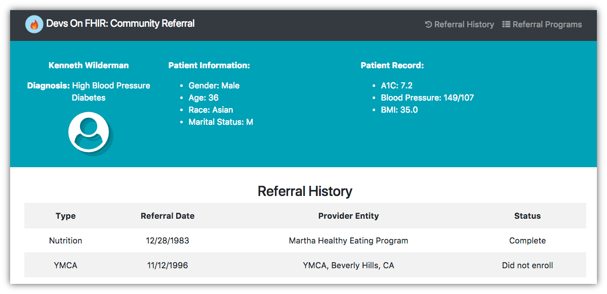

5. The bottom of the page includes the list of qualifying programs for the selected patient and diagnosis. 
	
	The graphs display program results with A1C, BMI and blood pressure for patients that have completed the program and those that withdrew before completion. 
	
	For each metric, it displays the number of patients under or over the threshold before and after the program completion/withdrawal. This data only includes population health data relevant for the selected patient.

	The example below includes graphs with information "based on population health data for married asian males, ages 30-39, with diabetes". This is based on the selected patient, "Kenneth Wilderman" who is Male, 36 years old, Asian, and married.

	The A1C graph for the program, HealthEdu includes data in purple for patients that have completed the program and red for patients that withdrew before completion. The graph displays purple in *Before >=5.7%* is much greater than the purple in *After >=5.7%* whicH indicates the number of patients with A1C value at risk before enrolling and completing the program at HealthEdu go down by more than half after completing the program.

	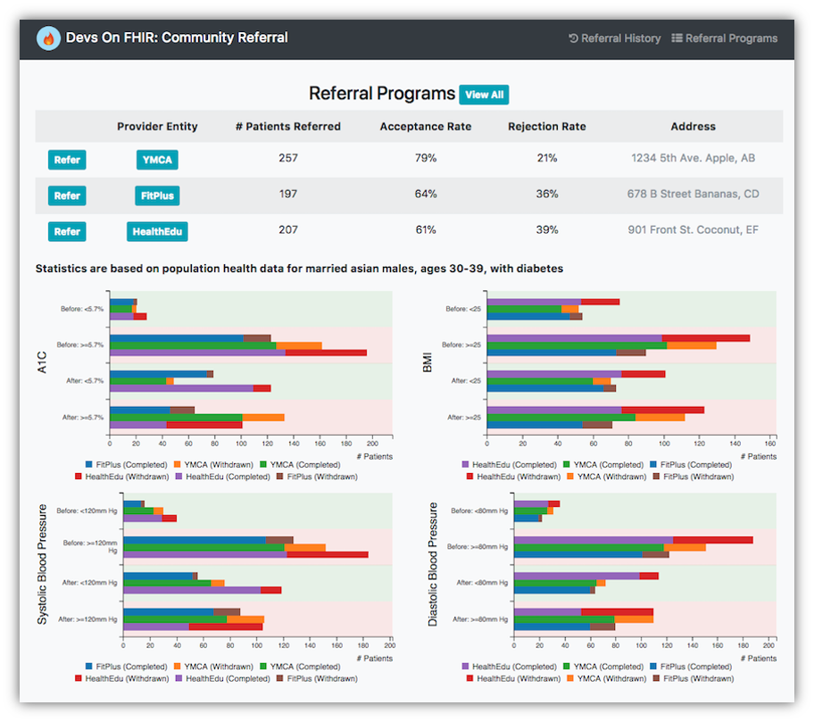

6. Clicking on the program names will update the graphs so each program can be reviewed in detail.

	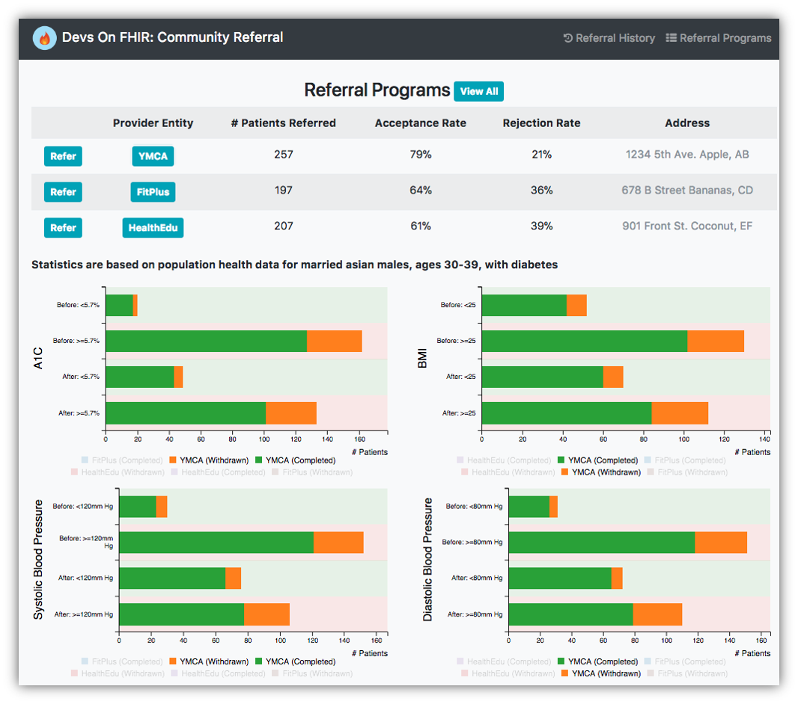

	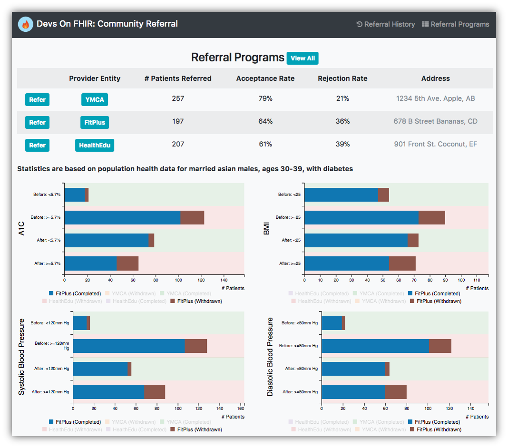

	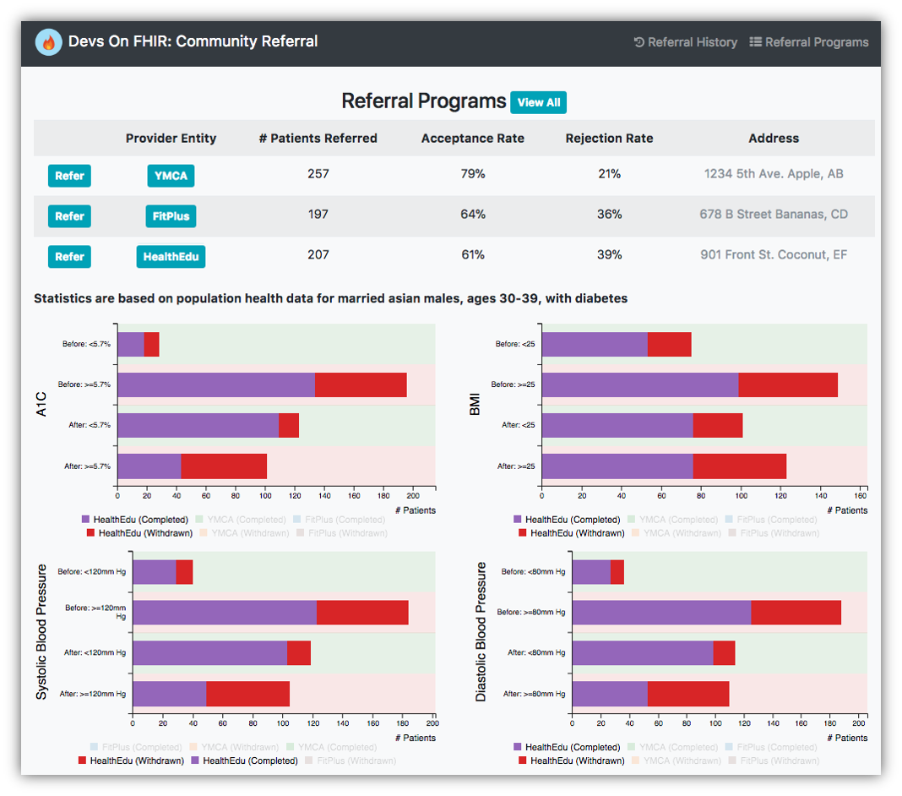

7. Hovering over the graph will display the counts for each section. Each element in the legend is also clickable. Doing so will show or hide the associated data

	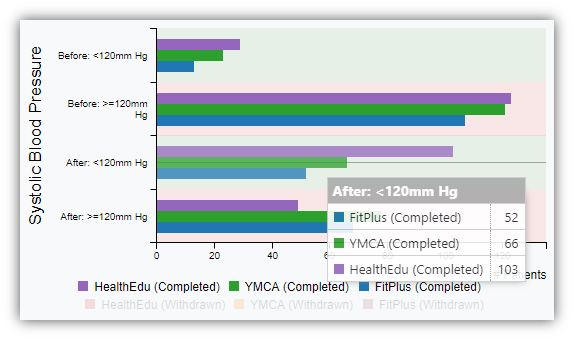

8. Clicking on “View All” next to “Referral Programs” will once again display data for all the programs.
	
	

9.  Clicking on "Refer" next to the desired program will present an electronic referral form with basic information already populated.

	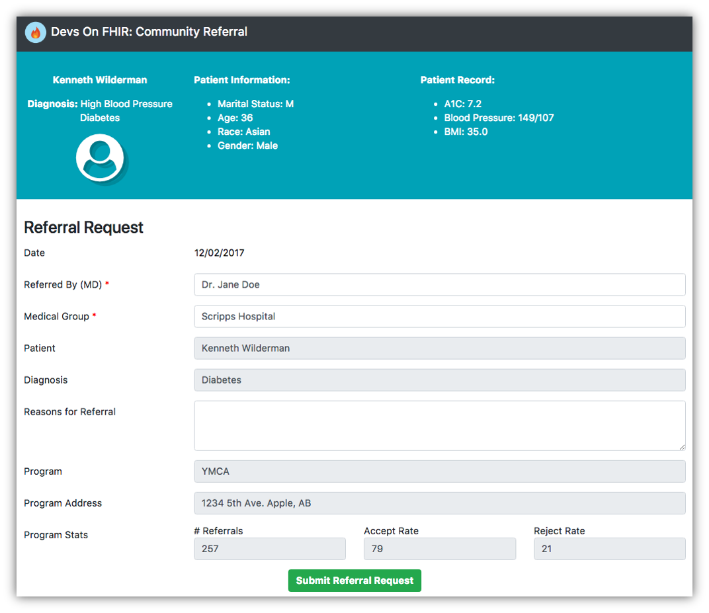

10.  Clicking on "Submit Referral Request" will submit the form. The information is not stored on the server - a FHIR ReferralRequest JSON object is created and presented as the result of our prototype application.
	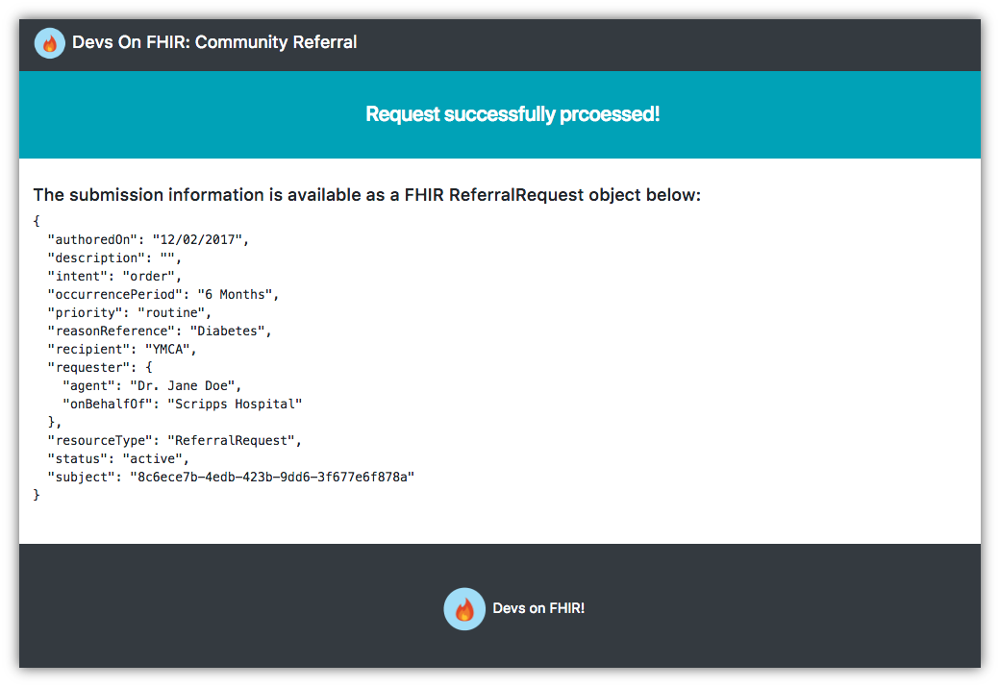

#### Acknowledgements

This project uses source code and other resources from third-party open
source projects. These are as follows.

* **CDS Hooks Sandbox**
The Docker image for the sample EHR (CDS Hooks Sandbox) server was produced from a modified version of the official [CDS Hooks Sandbox repo](https://github.com/cds-hooks/sandbox). The CDS Hooks patient referral service portion of this project also contains code from that repo. The CDS Hooks project is licensed under the Apache License, Version 2.0.

* **FHIR Server** 
The Docker image for the FHIR server was produced after modifying some of the sample data found in its parent [HAPI-FHIR Docker image](https://hub.docker.com/r/djohnson325/small-fhir/). The [HAPI-FHIR project](https://github.com/jamesagnew/hapi-fhir) is licensed under the Apache Software License 2.0.


