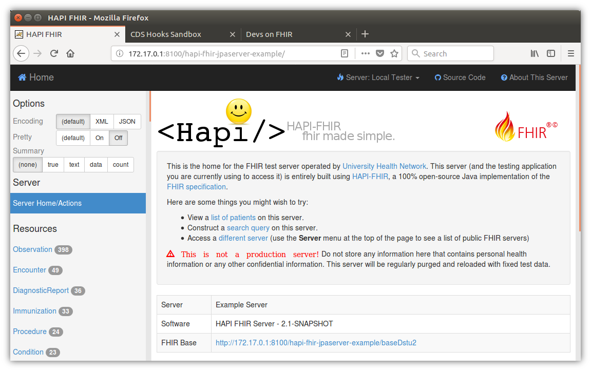
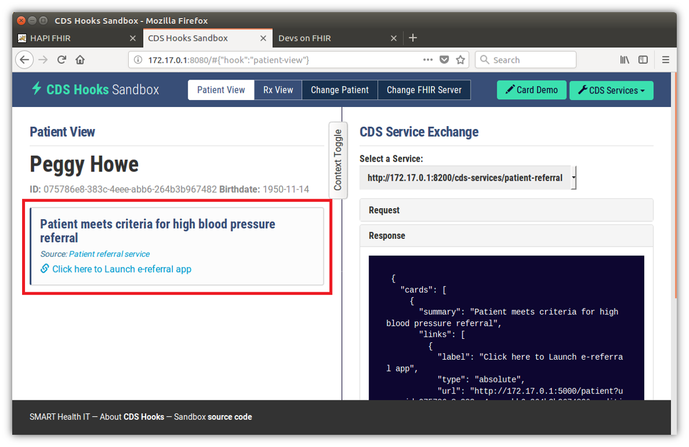
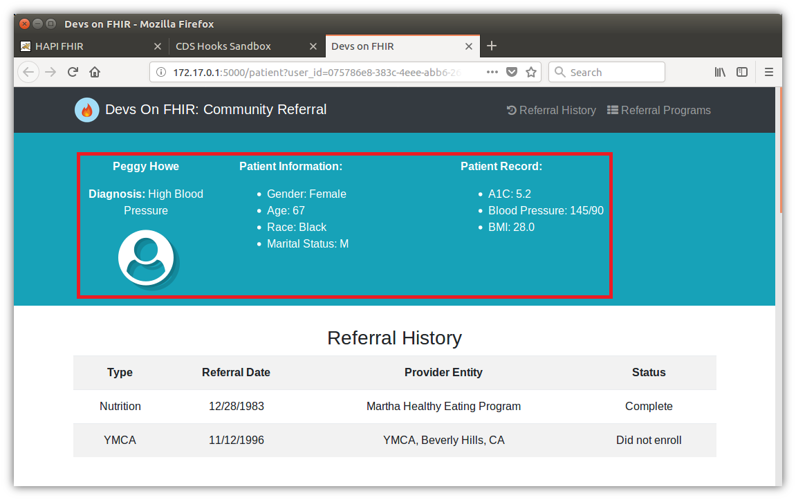

# Special Instructions: Community Referral Application #

**Team Name:** Devs on FHIR
**Mentors:** Arunkumar Srinivasan (external), Jon Bidwell (TA)
**Team Members:** Dhruv Saksena, Elizabeth Coviello, Venu Shankar, Xia Lee
**Project Name:** [Leverage Population Health Data To Improve Patient Adherence In Community Referral](http://cs6440.gatech.edu/wp-content/uploads/sites/634/2017/09/10.-CatalogPageCDCSrinivasan-Loonsk.pdf)

### Installation


* Git clone the repository (https://github.com/CDCgov/GaTech-Fall2017-Srinivasan-ImproveAdherence-DEVSonFHIR.git)

* Navigate to the *Final Delivery* subdirectory in the newly cloned project directory

	```bash
	cd GaTech-Fall2017-Srinivasan-ImproveAdherence-DEVSonFHIR/Final\ Delivery/
	```

* These next steps **must be run either as a user with docker run privileges or as root** (using "sudo su"). Note that it's not necessarily enough to just run each command individually with sudo, as the $BASE_URL environment variable won't get carried over correctly. 
* Set the base URL where the services will run.  For instance, if your base URL is "http://example.com", then the services will be at the following by default:
	* Sample EHR (CDS Hooks Sandbox) server: http://example.com:8080
	* FHIR server: http://example.com:8100/hapi-fhir-jpaserver-example
	* Referral (CDS Hooks) service: http://example.com:8200/cds-services/patient-referral
	* Referral web app: http://example.com:5000

* **Note:** If you are using a proxy, your server URLs may be different.
	
* If you are running locally, you could try using the Docker host as the BASE_URL:
	
	```bash
	export BASE_URL=http://$(ifconfig|grep -E "([0-9]{1,3}\\.){3}[0-9]{1,3}" \
	| grep -v 127.0.0.1 | awk '{print $2}' | cut -f2 -d: | head -n1)
	```

* Otherwise, use an externally-facing URL or IP address (**BASE_URL must prefixed by "http" or "https"**).
	
	```bash
	export BASE_URL=http://YOUR-URL-HERE.com
	```

* By default, the FHIR_URL points to the $BASE_URL:8100. However, **if you have your FHIR server setup at a different URL or port number** you must configure that in the docker-compose.yml file under the *Final Delivery* directory. In that file, update the FHIR_URL (everywhere where it appears) to point to the base of your FHIR server. The lines that need to be updated look like the following.
	
	```bash
	FHIR_URL: ${BASE_URL}:8100/hapi-fhir-jpaserver-example/baseDstu2
	```

* Now run the docker-compose command.

	```bash
	docker-compose up -d
	```

	This command may take a while to run (anywhere between 5-45 minutes depending on your machine), and **you may also have to wait some extra time after the docker-compose command completes** before all the services fully come up.


### Verification 

* To verify everything is up, in your web browser, navigate to $BASE_URL:8100/hapi-fhir-jpaserver-example/ (or your FHIR server URL without the base part) and make sure that the HAPI-FHIR page comes up with no error messages. It should look similar to this:

	

*  Navigate to $BASE_URL:8080 (the CDS Hooks server URL). It should look like the following:

	

	This is the main EHR (CDS Hooks Sandbox) page. Make sure the information inside the red box is present, particularly the "**Patient meets criteria for high blood pressure**" card. If the card says "Loading", that probably means not all the services are up yet.

* Now click on the "**Click here to Launch e-referral app**" link. You should see the following:

	

	Make sure the information in the red box is present, and there are no blank values. Setup done!

Further usage instructions are in the manual.


### Note on Docker images

We pre-created some Docker images (FHIR server, CDS Hooks Sandbox server) after making slight modifications from the original third-party sources. If you wish to see what modifications went into these Docker images, see the notes in the README.md file under the *tools* subdirectory of the repo root.
